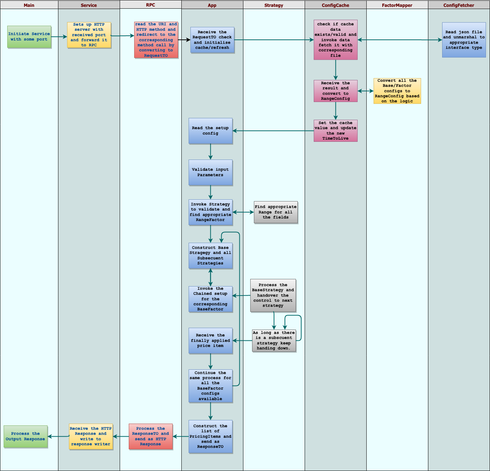

# Pricing Engine - GoLang
Application in goLang to work in a simple pricing engine considering various factors from the customer who is trying to rent a vehicle from a rental service provider.


## Requirements
The requirement of this application is to bring up a go based REST API which will determine the rental cost of a car bases on the attributes of the customer who is purchasing it. You can go through the detailed requirements [Here](./REQUIREMENTS.md). The essential attributes that play key aspects in the pricing calculation are as follows:
- Rent Duration
- Age of the customer
- Insurance Group
- Validity of the licence held by the customer


## The Pricing formula
> Total Rental Cost = BaseFare based on the Duration * Factor based on Age * Factor based on the Insurance Group * Factor based on Licence Validity


## Understanding the existing setup
The current application is built on top on an existing code as per the [Requirements](./REQUIREMENTS.md). The setup typically had a layered data flow among the components as follows:
- The main.go file which typically invokes the service built on top of the RPC/Middleware libraries.
- The service that serves various REST end point for the application and passing on the data to RPC layer.
- The RPC which typically takes care of doing the conversion from HTTP middleware understandable data to the Application understandable data.
- Then the RPC passes the application understandable data to the *App* component which has all the business logics of computing the pricing and serving the required data.


## The Approach in solving the problem
- Single responsibility Priciple :
- Generalisation and Specialisation :
- Configurable and plugin code : Decoupling the configuration
- Strategy Pattern :
- Chain of command pattern :
- Functional Decomposition :
- Non-TDD/Implementation first : I am a hard core follower of TDD principles while developing any of the application or business logics. However, due to the lack of experience in go programming language I was not able to follow TDD approach 100%. During the initial spike/experimental faces I just started with the implementation and then jumped in to the respective unit test/functional test later.
- Test Pyramid
 - Integration testing with httptest
 - Unit test with testing framework

## The Flow
## Architecture:



## The Endpoints
### Generate Pricing for a customer
##### Request
```http
POST /generate_pricing HTTP/1.1
Host: localhost:3000
Content-Type: application/json

{
    "date_of_birth": "1970-12-04",
    "insurance_group": 12,
    "license_held_since": "1988-08-01"
}
```
### Request format:
*date_of_birth* – Date of Birth of the customer who is trying to rent the vehicle
*insurance_group* – the insurance group to which the customer belongs to
*license_held_since* – The date of acquiring of the Driver's licence by the existing customer

##### Response
Returns: Empty body with one of the following:

200 – in case of success


```http
HTTP/1.1 200 OK
Content-Type: application/json
{
  "input": {
          "date_of_birth": "1970-12-04",
          "insurance_group": 12,
          "license_held_since": "1988-08-01"
      },
      "is-eligible": true,
      "message": "Success",
      "pricing": [
          {
              "premium": 278.28254999999996,
              "currency": "£",
              "fare_group": "0.5 hours, Driver Age >26, Insurance Group:9-16, Licence Validity:6"
          },
          /*
          {....},
          {....},
          .....  */
      ]
}

```

#### Get current pricing configuration ranges
##### Request
```http
GET /statistics HTTP/1.1
Host: localhost:3000


```

##### Response
Returns: The computed statistics for all the posted transaction or empty if there are no transactions present.

```http
HTTP/1.1 200
Content-Type: application/json;charset=UTF-8
{
  "base-rate": [
        {
            "Start": 0,
            "End": 1800,
            "IsEligible": true,
            "Value": 273,
            "Label": "0.5 hours"
        },
        {....}
        ....
        ],
    "driver-age-factor": [
        {
            "Start": 0,
            "End": 16,
            "IsEligible": false,
            "Value": 0,
            "Label": "Driver Age:0-16"
        },
        /*{...}
        ....*/
      ],
      "insurance-group-factor": [
          {
              "Start": 1,
              "End": 8,
              "IsEligible": true,
              "Value": 1,
              "Label": "Insurance Group:1-8"
          },
          /*{...}
          ....*/
      ],
      "licence-validity-factor": [
        {
            "Start": 0,
            "End": 1,
            "IsEligible": true,
            "Value": 1.1,
            "Label": "Licence Validity:0-1"
        },
        /*{...}
        ....*/
      ]
    }
```


## Test coverage data
Following is the entire test coverage data for the project
```
go test ./test/... -p 1 -v
=== RUN   TestMain
--- PASS: TestMain (0.00s)
PASS
ok      pricingengine/test  0.359s
=== RUN   TestPriceGenerationAppWithActualConfigs
=== RUN   TestPriceGenerationAppWithActualConfigs/TestPriceGenerationAppToGetValidGeneratedPriceList-FailureScenario-1
=== RUN   TestPriceGenerationAppWithActualConfigs/TestPriceGenerationAppToGetValidGeneratedPriceList-FailureScenario-2
=== RUN   TestPriceGenerationAppWithActualConfigs/TestPriceGenerationAppToGetValidGeneratedPriceList-FailureScenario-3
=== RUN   TestPriceGenerationAppWithActualConfigs/TestPriceGenerationAppToGetValidGeneratedPriceList-FailureScenario-4
=== RUN   TestPriceGenerationAppWithActualConfigs/TestPriceGenerationAppToGetValidGeneratedPriceList-FailureScenario-5
=== RUN   TestPriceGenerationAppWithActualConfigs/TestPriceGenerationAppToGetValidGeneratedPriceList-SuccessScenario-1
=== RUN   TestPriceGenerationAppWithActualConfigs/TestPriceGenerationAppToGetValidGeneratedPriceList-SuccessScenario-2
--- PASS: TestPriceGenerationAppWithActualConfigs (0.02s)
   --- PASS: TestPriceGenerationAppWithActualConfigs/TestPriceGenerationAppToGetValidGeneratedPriceList-FailureScenario-1 (0.02s)
   --- PASS: TestPriceGenerationAppWithActualConfigs/TestPriceGenerationAppToGetValidGeneratedPriceList-FailureScenario-2 (0.00s)
   --- PASS: TestPriceGenerationAppWithActualConfigs/TestPriceGenerationAppToGetValidGeneratedPriceList-FailureScenario-3 (0.00s)
   --- PASS: TestPriceGenerationAppWithActualConfigs/TestPriceGenerationAppToGetValidGeneratedPriceList-FailureScenario-4 (0.00s)
   --- PASS: TestPriceGenerationAppWithActualConfigs/TestPriceGenerationAppToGetValidGeneratedPriceList-FailureScenario-5 (0.00s)
   --- PASS: TestPriceGenerationAppWithActualConfigs/TestPriceGenerationAppToGetValidGeneratedPriceList-SuccessScenario-1 (0.00s)
   --- PASS: TestPriceGenerationAppWithActualConfigs/TestPriceGenerationAppToGetValidGeneratedPriceList-SuccessScenario-2 (0.00s)
PASS
ok      pricingengine/test/app  0.414s
=== RUN   TestConfigCacheScenarios
=== RUN   TestConfigCacheScenarios/TestConfigCacheInitOnExistingCache
=== RUN   TestConfigCacheScenarios/TestConfigCacheInitWithNoCacheRefreshButNoTTL
=== RUN   TestConfigCacheScenarios/TestConfigCacheInitWithCacheRefreshFlag
=== RUN   TestConfigCacheScenarios/TestConfigCacheInitWithCacheRefreshAfterTimeout
--- PASS: TestConfigCacheScenarios (0.02s)
   --- PASS: TestConfigCacheScenarios/TestConfigCacheInitOnExistingCache (0.02s)
   --- PASS: TestConfigCacheScenarios/TestConfigCacheInitWithNoCacheRefreshButNoTTL (0.00s)
   --- PASS: TestConfigCacheScenarios/TestConfigCacheInitWithCacheRefreshFlag (0.00s)
   --- PASS: TestConfigCacheScenarios/TestConfigCacheInitWithCacheRefreshAfterTimeout (0.00s)
=== RUN   TestConfigFetch
=== RUN   TestConfigFetch/TestConfigFetchSuccess
=== RUN   TestConfigFetch/TestConfigFetchFileNotFoundError
--- PASS: TestConfigFetch (0.00s)
   --- PASS: TestConfigFetch/TestConfigFetchSuccess (0.00s)
   --- PASS: TestConfigFetch/TestConfigFetchFileNotFoundError (0.00s)
PASS
ok      pricingengine/test/config   0.389s
=== RUN   TestServiceEndpointsIntegrationTestWithActualConfigs
=== RUN   TestServiceEndpointsIntegrationTestWithActualConfigs/TestRESTAPIEndpointToGetValidGeneratedPriceList-FailureScenario-1
[64/64]0xc0000a8200
Want 'some', got '{"input":{"date_of_birth":"","insurance_group":0,"license_held_since":""},"is-eligible":false,"message":"DateOfBirth cannot be empty","pricing":null}'0xc0000927e0
=== RUN   TestServiceEndpointsIntegrationTestWithActualConfigs/TestRESTAPIEndpointToGetValidGeneratedPriceList-FailureScenario-2
[74/80]0xc00010c0f0
Want 'some', got '{"input":{"date_of_birth":"2006-01-02","insurance_group":0,"license_held_since":""},"is-eligible":false,"message":"InsuranceGroup should be a Positive number","pricing":null}'0xc000092c60
=== RUN   TestServiceEndpointsIntegrationTestWithActualConfigs/TestRESTAPIEndpointToGetValidGeneratedPriceList-FailureScenario-3
[75/80]0xc00010c230
Want 'some', got '{"input":{"date_of_birth":"2006-01-02","insurance_group":20,"license_held_since":""},"is-eligible":false,"message":"LicenseHeldSince Date cannot be empty","pricing":null}'0xc0000930e0
=== RUN   TestServiceEndpointsIntegrationTestWithActualConfigs/TestRESTAPIEndpointToGetValidGeneratedPriceList-FailureScenario-4
[85/96]0xc000096720
Want 'some', got '{"input":{"date_of_birth":"2001-01-02","insurance_group":20,"license_held_since":"2006-01-02"},"is-eligible":false,"message":"Declined due to :Insurance Group:8","pricing":null}'0xc000093560
=== RUN   TestServiceEndpointsIntegrationTestWithActualConfigs/TestRESTAPIEndpointToGetValidGeneratedPriceList-FailureScenario-5
[85/96]0xc000096900
Want 'some', got '{"input":{"date_of_birth":"2006-08-02","insurance_group":20,"license_held_since":"2006-01-02"},"is-eligible":false,"message":"Declined due to :Driver Age:0-16","pricing":null}'0xc0000939e0
=== RUN   TestServiceEndpointsIntegrationTestWithActualConfigs/TestRESTAPIEndpointToGetValidGeneratedPriceList-SuccessScenario-1
[84/96]0xc000096ae0
Want 'some', got '{"input":{"date_of_birth":"2001-08-02","insurance_group":7,"license_held_since":"2014-08-02"},"is-eligible":true,"message":"Success","pricing":[{"premium":259.349,"currency":"£","fare_group":"0.5 hours, Driver Age:16-26, Insurance Group:1-8, Licence Validity:6"},{"premium":4943.8,"currency":"£","fare_group":"96 hours / 4 days, Driver Age:16-26, Insurance Group:1-8, Licence Validity:6"}]}'0xc000093e60
=== RUN   TestServiceEndpointsIntegrationTestWithActualConfigs/TestRESTAPIEndpointToGetValidGeneratedPriceList-SuccessScenario-2
[84/96]0xc000096d80
Want 'some', got '{"input":{"date_of_birth":"2001-08-02","insurance_group":7,"license_held_since":"2016-08-02"},"is-eligible":true,"message":"Success","pricing":[{"premium":300.3,"currency":"£","fare_group":"0.5 hours, Driver Age:16-26, Insurance Group:1-8, Licence Validity:0-6"},{"premium":5724.4,"currency":"£","fare_group":"96 hours / 4 days, Driver Age:16-26, Insurance Group:1-8, Licence Validity:0-6"}]}'0xc000144300
--- PASS: TestServiceEndpointsIntegrationTestWithActualConfigs (0.03s)
   --- PASS: TestServiceEndpointsIntegrationTestWithActualConfigs/TestRESTAPIEndpointToGetValidGeneratedPriceList-FailureScenario-1 (0.02s)
   --- PASS: TestServiceEndpointsIntegrationTestWithActualConfigs/TestRESTAPIEndpointToGetValidGeneratedPriceList-FailureScenario-2 (0.00s)
   --- PASS: TestServiceEndpointsIntegrationTestWithActualConfigs/TestRESTAPIEndpointToGetValidGeneratedPriceList-FailureScenario-3 (0.00s)
   --- PASS: TestServiceEndpointsIntegrationTestWithActualConfigs/TestRESTAPIEndpointToGetValidGeneratedPriceList-FailureScenario-4 (0.00s)
   --- PASS: TestServiceEndpointsIntegrationTestWithActualConfigs/TestRESTAPIEndpointToGetValidGeneratedPriceList-FailureScenario-5 (0.00s)
   --- PASS: TestServiceEndpointsIntegrationTestWithActualConfigs/TestRESTAPIEndpointToGetValidGeneratedPriceList-SuccessScenario-1 (0.00s)
   --- PASS: TestServiceEndpointsIntegrationTestWithActualConfigs/TestRESTAPIEndpointToGetValidGeneratedPriceList-SuccessScenario-2 (0.00s)
PASS
ok      pricingengine/test/service  0.463s
=== RUN   TestPricingStrategyVariedConfigs
=== RUN   TestPricingStrategyVariedConfigs/TestPricingStrategyVariedConfigsToApplyBaseStrategyWithChainStrategy
2021/08/02 17:04:23 Found a chain function, Passing on the result for further computation
=== RUN   TestPricingStrategyVariedConfigs/TestPricingStrategyVariedConfigsToApplyBaseStrategyWithoutChainStrategy
=== RUN   TestPricingStrategyVariedConfigs/TestPricingStrategyVariedConfigsToApplySubsecuentFactorsToPricingWithChainStrategy
2021/08/02 17:04:23 Found a chain function, Passing on the result for further computation
2021/08/02 17:04:23 Found a chain function, Passing on the result for further computation
=== RUN   TestPricingStrategyVariedConfigs/TestPricingStrategyVariedConfigsToApplySubsecuentFactorsToPricingWithoutChainStrategy
2021/08/02 17:04:23 Found a chain function, Passing on the result for further computation
=== RUN   TestPricingStrategyVariedConfigs/TestPricingStrategyVariedConfigsToFindMatchingLicenceValidityFactor-Success-Senario
=== RUN   TestPricingStrategyVariedConfigs/TestPricingStrategyVariedConfigsToFindMatchingLicenceValidityFactor-NotFound-Senario
=== RUN   TestPricingStrategyVariedConfigs/TestPricingStrategyVariedConfigsToFindMatchingLicenceValidityFactor-InvalidDate-Senario
=== RUN   TestPricingStrategyVariedConfigs/TestPricingStrategyVariedConfigsToFindMatchingInsuranceGroupFactor-Success-Senario
=== RUN   TestPricingStrategyVariedConfigs/TestPricingStrategyVariedConfigsToFindMatchingInsuranceGroupFactor-NotFound-Senario
=== RUN   TestPricingStrategyVariedConfigs/TestPricingStrategyVariedConfigsToFindMatchingDriverAgeFactor-Success-Senario
2021/08/02 17:04:23 Checking the driver factor for date_of_birth= 2018-08-02  parse_dob_t= 2018-08-02 00:00:00 +0000 UTC  age= 3
=== RUN   TestPricingStrategyVariedConfigs/TestPricingStrategyVariedConfigsToFindMatchingDriverAgeFactor-NotFound-Senario
=== RUN   TestPricingStrategyVariedConfigs/TestPricingStrategyVariedConfigsToFindMatchingDriverAgeFactor-InvalidDate-Senario
--- PASS: TestPricingStrategyVariedConfigs (0.02s)
   --- PASS: TestPricingStrategyVariedConfigs/TestPricingStrategyVariedConfigsToApplyBaseStrategyWithChainStrategy (0.02s)
   --- PASS: TestPricingStrategyVariedConfigs/TestPricingStrategyVariedConfigsToApplyBaseStrategyWithoutChainStrategy (0.00s)
   --- PASS: TestPricingStrategyVariedConfigs/TestPricingStrategyVariedConfigsToApplySubsecuentFactorsToPricingWithChainStrategy (0.00s)
   --- PASS: TestPricingStrategyVariedConfigs/TestPricingStrategyVariedConfigsToApplySubsecuentFactorsToPricingWithoutChainStrategy (0.00s)
   --- PASS: TestPricingStrategyVariedConfigs/TestPricingStrategyVariedConfigsToFindMatchingLicenceValidityFactor-Success-Senario (0.00s)
   --- PASS: TestPricingStrategyVariedConfigs/TestPricingStrategyVariedConfigsToFindMatchingLicenceValidityFactor-NotFound-Senario (0.00s)
   --- PASS: TestPricingStrategyVariedConfigs/TestPricingStrategyVariedConfigsToFindMatchingLicenceValidityFactor-InvalidDate-Senario (0.00s)
   --- PASS: TestPricingStrategyVariedConfigs/TestPricingStrategyVariedConfigsToFindMatchingInsuranceGroupFactor-Success-Senario (0.00s)
   --- PASS: TestPricingStrategyVariedConfigs/TestPricingStrategyVariedConfigsToFindMatchingInsuranceGroupFactor-NotFound-Senario (0.00s)
   --- PASS: TestPricingStrategyVariedConfigs/TestPricingStrategyVariedConfigsToFindMatchingDriverAgeFactor-Success-Senario (0.00s)
   --- PASS: TestPricingStrategyVariedConfigs/TestPricingStrategyVariedConfigsToFindMatchingDriverAgeFactor-NotFound-Senario (0.00s)
   --- PASS: TestPricingStrategyVariedConfigs/TestPricingStrategyVariedConfigsToFindMatchingDriverAgeFactor-InvalidDate-Senario (0.00s)
PASS
ok      pricingengine/test/strategy 0.383s
=== RUN   TestAssert
--- PASS: TestAssert (0.00s)
=== RUN   TestFactorMapperFeaturesWithMockConfigs
=== RUN   TestFactorMapperFeaturesWithMockConfigs/TestFactorMapperBaseRateToRangeConfig-SuccessScenario
=== RUN   TestFactorMapperFeaturesWithMockConfigs/TestFactorMapperDriverAgeFactorToRangeConfig-SuccessScenario
=== RUN   TestFactorMapperFeaturesWithMockConfigs/TestFactorMapperInsuranceGroupFactorToRangeConfig-SuccessScenario
=== RUN   TestFactorMapperFeaturesWithMockConfigs/TestFactorMapperLicenceValidityFactorToRangeConfig-SuccessScenario
--- PASS: TestFactorMapperFeaturesWithMockConfigs (0.00s)
   --- PASS: TestFactorMapperFeaturesWithMockConfigs/TestFactorMapperBaseRateToRangeConfig-SuccessScenario (0.00s)
   --- PASS: TestFactorMapperFeaturesWithMockConfigs/TestFactorMapperDriverAgeFactorToRangeConfig-SuccessScenario (0.00s)
   --- PASS: TestFactorMapperFeaturesWithMockConfigs/TestFactorMapperInsuranceGroupFactorToRangeConfig-SuccessScenario (0.00s)
   --- PASS: TestFactorMapperFeaturesWithMockConfigs/TestFactorMapperLicenceValidityFactorToRangeConfig-SuccessScenario (0.00s)
PASS
ok      pricingengine/test/util 0.449s
➜  pricing-engine-go git:(master)
```

## Learning

## Enhancements and Potential Improvements:
- Improving performance using concurrency. I am always a fan of multi threading and concurrency. However, given that the expected time to complete this task is 4-5 hours and I am totally new to the functional programming aspects of golong I was not able to wrap my head around few of the concurrency concepts like defer, waitgroup and go coroutine execution.
- Better error handling at some of the places.

## Setting up the environment
This application is purely build on goLang. To run this application in your local you need to follow the below steps

#### Build:
```
go build ./cmd/.
```

#### Run
```
go run ./cmd/.
```


#### Test
```
go test ./test/... -p 1
```


### References:
Since this is a beginner/learning project based on golang I had to go through a lot of documentations and references related to syntaxes and approaches in arriving at the actual problem solution. All the references that were really useful during the project working can be found here: [References](./REFERENCES.md)
